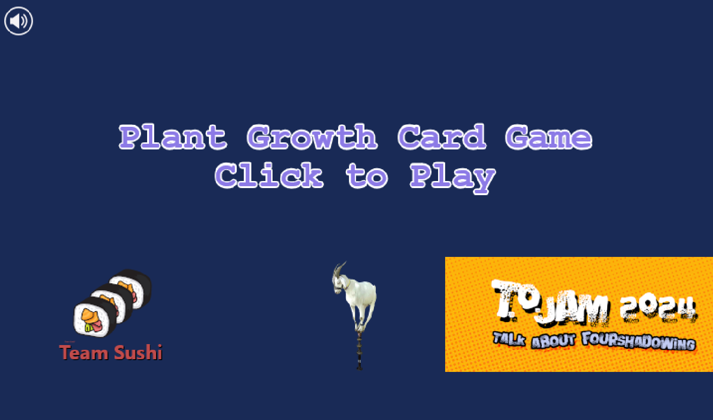

# plantjigsaw
A web based game for learning about plant growth via jigsaw puzzle pieces

## Instructions

1. Clone the repository.

2. Install dependencies with `npm install`.

3. Start the development server with `npm run dev`.

4. If you want to build the project, run `npm run build`.

## Game Design

A mad biologist is attempting to take over Camp Samac and only you can help by solving the plant puzzles finding the clues and bringing her to justice.

In an excape room, this will look something like: 
- matching growth formulas to familiar plants in the Laboratory Reception Area. Here's an explanation of how to implement it:
1. Prepare the materials: Create a set of cards or panels with growth formulas written on them, representing different plants. You can design the cards to resemble plant tags or use digital displays if preferred. Also, have a set of plant images or illustrations corresponding to each growth formula.
2. Set up the puzzle: Display the growth formula cards or panels on a wall or designated area in the room. Place the plant images or illustrations nearby, either in a separate pile or scattered around the room.
3. Provide instructions: Explain to the players that they need to match the growth formulas with the correct plant images or illustrations. Emphasize that each formula corresponds to a specific plant, and they need to make the correct associations.
4. Solve the puzzle: Players must analyze each growth formula card and carefully examine the plant images or illustrations to find the correct matches. They should consider the requirements mentioned in the growth formulas, such as sunlight, soil type, watering, and fertilizers. Encourage players to collaborate and discuss their observations to reach consensus.
5. Complete the puzzle: Once players have correctly matched all the growth formulas with the corresponding plant images or illustrations, they can proceed to the next step. This could involve unlocking a compartment, revealing a hidden clue, or accessing a new area within the escape room.

We will be creating a virtual jigsaw puzzle that implements the above.  Here is the content for each puzzle (to be regularized):

- Tomato (Solanum lycopersicum): Growth Formula: Sunshine + Proper Soil + Adequate Watering + Nutrient-rich Fertilizer = Thriving Tomato Plants
Sunflower (Helianthus annuus): Growth Formula: Sunlight + Well-drained Soil + Regular Watering + Balanced Fertilizer = Tall Sunflower Stalks and Vibrant Flower Heads
- Maple Tree (Acer species): Growth Formula: Sunlight (Some Varieties Tolerate Partial Shade) + Well-drained Soil + Watering as Needed + Tree Fertilizer = Healthy Maple Trees with Beautiful Fall Foliage
- Hosta (Hosta spp.): Growth Formula: Shade to Partial Shade + Moist Soil + Consistent Watering + Organic Enrichment = Lush Hosta Foliage and Striking Clumps
- Daylily (Hemerocallis spp.): Growth Formula: Sun to Partial Shade + Well-drained Soil + Regular Watering + Balanced Flower Fertilizer = Colorful Daylily Blooms and Strong Foliage
- Chrysanthemum (Chrysanthemum spp.): Growth Formula: Sunlight + Well-drained Soil + Moderate Watering + Chrysanthemum Fertilizer = Abundant Chrysanthemum Flowers and Compact Growth
- Peony (Paeonia spp.): Growth Formula: Sun to Partial Shade + Rich, Well-drained Soil + Regular Watering + Organic Matter = Large, Fragrant Peony Blooms and Robust Stems
- Rose (Rosa spp.): Growth Formula: Sunlight + Fertile Soil + Consistent Watering + Rose Fertilizer = Healthy Rose Bushes with Beautiful Blooms and Healthy Foliage

Interactions:

For each left most piece (plant type), there is a selection of pieces that could potentially  match in each of the slots: 
- amount of sun
- soil type
- water needs
- fertilizer type

For each category, we should show 4 alternatives for each one as they are worked on.  If the user chooses the correct one it is locked in place.   IF they choose the wrong one, it buzzes and disappears.

At the top of the screen, there should be a hud that shows for each of the 7 puzzles, it shows solved puzzle status with a hidden letter that is revealed when it is solved.  The solved puzzle will show the letters of the word "Petunia" and when all puzzles are shown, it will show a picture of a petunia.

## Assets needed:
99x128 photo or illustration (for card front) of:
### Places to drop the cards (could be just text)
- Type of plant 
- Type of sun
- Type of soil
- Type of watering
- Type of fertilizer

### Types of plant (photo?)
- tomato on plant
- sunflower on stalk
- maple tree
- hosta
- daylily
- chrysanthemum
- peony
- rose on bush

### Types of Sun
- full sun
- partal sun
- Shade to Partial Shade: Illustration of shaded area with dappled sunlight.

### Types of soil
- sandy (well drained) soil - Illustration of soil with proper drainage, perhaps with water draining away.
- moist soil - Illustration of soil with appropriate moisture, not overly wet or dry.
- rich/fertile soil - Illustration of healthy soil with visible nutrients and texture.
- Rich, Well-drained Soil: Illustration combining rich soil with good drainage properties.

### Types of watering
-    Adequate Watering: Illustration of watering can or a hose watering the plants.
-    Regular/Consistent Watering: Illustration of plants being watered on a consistent schedule. or a watering schedule
-    Moderate Watering: Illustration of watering can with less water than above or less on the schedule

### Types of fertilizer
-    Nutrient-rich Fertilizer: Illustration of a bag or container of fertilizer with visible nutrients.
-    Balanced Fertilizer: Illustration of a fertilizer bag with balanced N-P-K ratios (Nitrogen, Phosphorus, Potassium).
-    Tree Fertilizer: Illustration of fertilizer specifically formulated for trees, perhaps with a tree and fertilizer bag
-    Organic Matter/Enrichment: Illustration of organic matter like compost or mulch being added to soil. OR Illustration of compost or organic material being mixed into the soil. 
-    Balanced Flower Fertilizer: Illustration of fertilizer specifically formulated for flowering plants.
-    Chrysanthemum Fertilizer: Illustration of fertilizer designed for chrysanthemum plants, perhaps with chrysanthemum flowers.
-    Rose Fertilizer: Illustration of fertilizer tailored for roses, perhaps with rose flowers or bushes.

### End of game reward (with escape room clue)
- Picture of a petunia

### Sound effects needed
- Game start flourish (3-5s)
- Click on tile piece (0.5s)
- Sucessful match chime (1s)
- Bad match buzzer (1s)
- Completed puzzle (one of seven) flourish (3-5s)
- Reveal letter of clue chime (1s)
- Final game victory flourish (5s)

## Credits
Programming: Joseph McCabe

Art Wrangling and Programming: Jillian Arnott

Sound Effects: Isa Marie Gutierrez

Music: Grant Craven

Programming and Game Design: Dale Wick

Created for TOJam game jam http://www.tojam.ca/ 2024 "Talk About Foreshadowing"

- Sushi image: <a href='https://pngtree.com/freepng/sushi-hosomaki-simple-food-vector_5949964.html'>png image from pngtree.com/</a>
- Card Back Image by <a href=" https://www.vectorportal.com" >Vectorportal.com</a>,  <a class="external text" href="https://creativecommons.org/licenses/by/4.0/" >CC BY</a>
